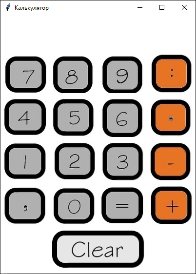

# Калькулятор 533 группы НПК
## В этой документации подробная инструкция по использованию калькулятора.

1. Запустите графический калькулятор.

   (для этого необходимо ввести `python calc.py`)

   

2. На экране всплыло окно калькулятора, чтобы набрать нужные числа - нажимайте на кнопки в готовом графическом интерфейсе.

3. Введите необходимое действие:  - , +, : , *.

4. Для получения результата нажмите на кнопку "=".

5. У вас получился готовый результат.

## Инструкция по запуску
Установите [Python](https://www.python.org/downloads/)

Запустите калькулятор. Для этого необходимо ввести команду: 
> python calc.py

Для того, чтобы открыть калькулятор в обычном терминале введите:
> python calc-term.py

Чтобы запустить тест введите команду:
> python -m unittest discover test

